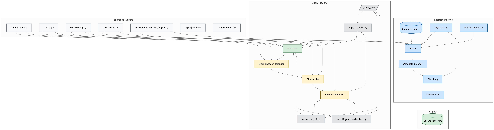

# 🧠 Production-Ready Multilingual RAG System for Tender Documents

**RAGbot** is a production-grade Retrieval-Augmented Generation (RAG) system specifically designed for **German public tender documents** (Vergabeunterlagen) with full multilingual support.

Query unstructured procurement data in **German or English** and receive **accurate, grounded, source-cited answers** through an intuitive chat interface.

This system runs **100% offline** on your local machine using:
- **Qdrant** for vector storage
- **Jina Embeddings v3** (1024-D) for semantic search  
- **Ollama** for local LLM inference (Qwen2.5, Llama, Mistral)
- **Streamlit** for the web interface

---

## ✨ Key Features

### Core RAG Capabilities
* 🔎 **Multilingual Semantic Search** - Query in German or English, retrieve from both
* 📑 **Rich Document Support** - PDF, Excel, DOCX, scanned files (OCR via Tesseract)
* ⚡ **High-Performance Embeddings** - Jina v3 (1024-D) with GPU acceleration
* 🗄️ **Qdrant Vector DB** - Fast, persistent semantic search with 29,086+ chunks
* 🤖 **Local LLM Generation** - Ollama (Qwen2.5:1.5b default, supports Llama/Mistral)
* 📊 **Metadata-Aware Routing** - Direct DTAD-ID lookups, date/region filters
* 🎯 **Citation Grounding** - Every answer cites sources with [1], [2] references
* � **Privacy-First** - Everything runs locally, zero external API calls

### Production Features
* ✅ **Graceful Error Handling** - Handles missing collections, network issues
* � **Metadata Integration** - tenders with normalized DTAD-ID, dates, regions  
* 🧪 **Test Suite** - Comprehensive test queries and validation scripts
* 📖 **Complete Documentation** - Quickstart, production guide, testing guide
* 🚀 **One-Command Deployment** - `deploy_production.py` script included

---

## 🏗️ System Architecture

```mermaid
flowchart LR
    A[📄 Tender Docs (PDF, Excel, Word, OCR)] --> B[🧹 Parser & Metadata Cleaner]
    B --> C[✂️ Chunking + GPU Embeddings]
    C --> D[(🗄️ Qdrant Vector DB)]
    D --> E[🔎 Retriever (Top-K Search)]
    E --> F[🤖 Cross-Encoder Reranker]
    F --> G[🧠 LLM via Ollama]
    G --> H[📝 Answer Generator]
    H --> I[💻 Streamlit UI]

    subgraph User
        Q[❓ User Query]
        R[📑 Structured Answer + Sources]
    end

    Q --> E
    I --> R
```



---

## 🚀 Quick Start

### Prerequisites
- Python 3.10+ (Conda environment recommended)
- Docker (for Qdrant)
- Ollama (for local LLMs)
- 8GB+ RAM, GPU recommended for embeddings

### 1️⃣ Clone Repository

```bash
git clone https://github.com/ShalinVachheta017/ragbot-core.git
cd ragbot-core
```

### 2️⃣ Set Up Environment

```bash
# Create conda environment
conda create -n mllocalag python=3.10
conda activate mllocalag

# Install dependencies
pip install -r requirements.txt
pip install pytesseract  # For OCR support
```

### 3️⃣ Start Qdrant Vector Database

```bash
docker compose up -d
# Verify: http://localhost:6333/dashboard
```

### 4️⃣ Install Ollama Models

```bash
# Install Ollama from https://ollama.ai
ollama pull qwen2.5:1.5b
ollama pull llama3.2:1b  # Optional alternative
```

### 5️⃣ Index Your Documents

```bash
# Parse metadata
python scripts/parse_excel.py

# Embed and index documents (takes 5-10 minutes)
python scripts/embed.py --mode fresh

# Verify indexing
curl http://localhost:6333/collections/tender_chunks
```

### 6️⃣ Launch Streamlit UI

```bash
streamlit run ui/app_streamlit.py
# Open browser: http://localhost:8501
```

**Ready!** Try queries like:
- `"Was ist DTAD-ID 20046891?"`
- `"Show me tenders from 2024"`
- `"Tenders in Dresden region"`

---

## 🖥️ UI Preview

* Query tender docs with natural language (DE/EN)
* Filter by metadata (e.g. CPV codes, filenames)
* Adjust `Top-K results` & retrail chunks(optional)
* Answers include **citations + categories + summaries**

---

## 📂 Project Structure

```
multilingual-ragbot/
├── core/                          # Core RAG components
│   ├── config.py                 # Configuration management
│   ├── qa.py                     # Q&A and retrieval logic
│   ├── search.py                 # Dense vector search
│   ├── domain.py                 # Data models
│   ├── io.py                     # File I/O utilities
│   └── logger.py                 # Logging configuration
├── ui/
│   └── app_streamlit.py          # 🖥️ Main Streamlit interface
├── scripts/
│   ├── embed.py                  # Document embedding pipeline
│   ├── ingest.py                 # Document ingestion
│   ├── parse_excel.py            # Metadata parser
│   └── search.py                 # Search utilities
├── data/
│   ├── metadata/                 # Tender metadata (cleaned_metadata.xlsx)
│   ├── extract/                  # Extracted document text
│   ├── raw/                      # Original documents
│   └── logs/                     # Processing logs
├── docs/                          # 📖 Documentation
│   ├── TESTING_GUIDE.md          # Testing procedures
│   ├── SYSTEM_REVIEW.md          # System architecture review
│   └── TEST_QUERIES.md           # Example test queries
├── QUICKSTART.md                  # ⚡ Quick start guide
├── PRODUCTION_GUIDE.md            # 🚀 Production deployment guide
├── deploy_production.py           # One-command deployment
├── docker-compose.yml             # Qdrant service configuration
├── requirements.txt               # Python dependencies
└── README.md                      # This file
```

## 📖 Documentation

- **[QUICKSTART.md](QUICKSTART.md)** - Get started in 5 minutes
- **[PRODUCTION_GUIDE.md](PRODUCTION_GUIDE.md)** - Production deployment
- **[docs/TESTING_GUIDE.md](docs/TESTING_GUIDE.md)** - Testing procedures
- **[docs/TEST_QUERIES.md](docs/TEST_QUERIES.md)** - Example queries

## 🎯 Example Queries

The system handles various query types:

**Direct ID Lookups:**
```
"Was ist DTAD-ID 20046891?"
"Show me tender 20047108"
```

**Temporal Queries:**
```
"Show me tenders from 2024"
"What tenders were published in March?"
```

**Geographic Filters:**
```
"Tenders in Dresden"
"Show me projects in Berlin region"
```

**Semantic Questions:**
```
"Welche Unterlagen sind für VOB-konforme Ausschreibungen erforderlich?"
"What are the technical specifications for IT projects?"
"Mindestlohn requirements in construction tenders"
```

**Metadata Routing:**
- DTAD-ID queries → Direct metadata lookup (instant)
- Date/year queries → Metadata filtering  
- Semantic queries → Vector search with context

---


## 🔮 Roadmap & Future Enhancements

### 🎯 Core Improvements (Planned)

**1. Hybrid Search (Dense + Sparse)**
- Add BM25 keyword search alongside current dense vector search
- Weighted fusion for better exact-match queries (CPV codes, DTAD-IDs)
- Expected: +15% recall improvement

**2. Cross-Encoder Reranker**
- Rerank top-K results before LLM generation
- Model: `ms-marco-MiniLM-L-6-v2` or similar
- Expected: +20% precision improvement

**3. Evaluation Framework**
- Test set with 50+ queries covering different scenarios
- Metrics: Hit Rate, MRR, Precision@k, answer faithfulness
- Automated regression testing

**4. Monitoring Dashboard**
- Track query latency, error rates, cache performance
- Log slow queries (>5s) and failures
- Simple Streamlit visualization

### 🛠️ Future Enhancements

**5. Semantic Chunking**
- Replace fixed 1024-char chunks with sentence-aware splitting
- Better context preservation

**6. Production Alerting**
- Email/Slack notifications for errors
- System health checks

**7. Multimodal Support**
- Extract and parse tables from PDFs
- Handle images and charts in tender documents

**8. Query Enhancement**
- Expand abbreviations and handle umlaut variations
- Better date range handling

---
maybe i find someelsse to improve I will add it later
## The project is still Ongoing ....