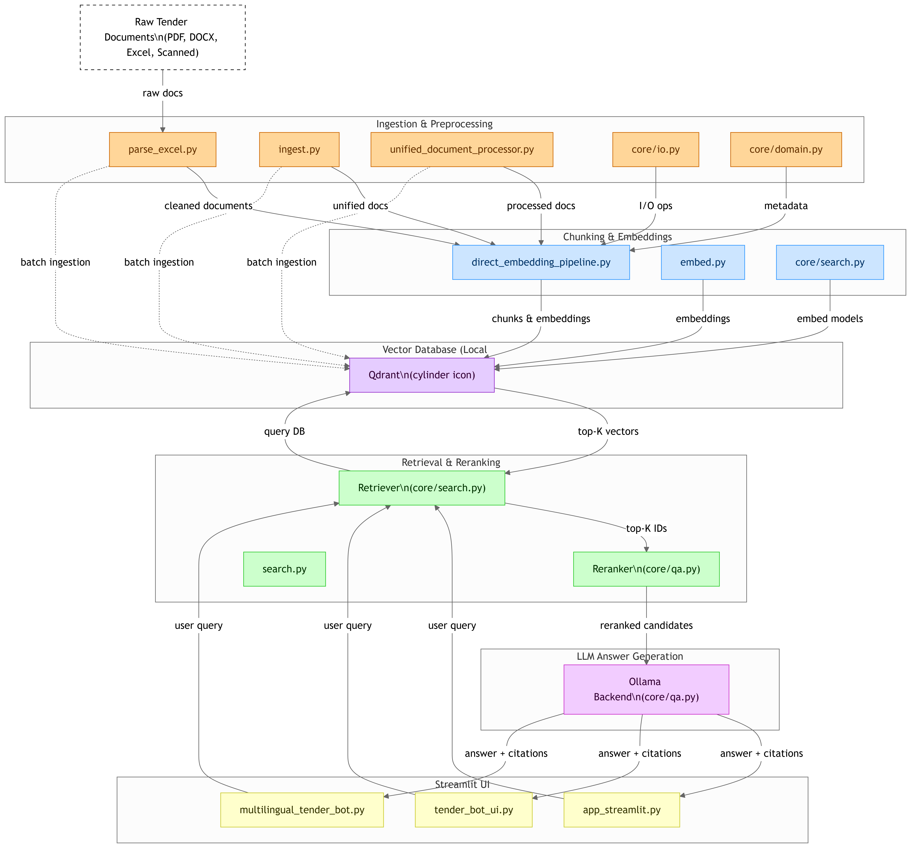

# 🧠 Production-Ready Multilingual RAG System for Tender Documents

**RAGbot** is a production-grade Retrieval-Augmented Generation (RAG) system specifically designed for **German public tender documents** (Vergabeunterlagen) with full multilingual support.

Query unstructured procurement data in **German or English** and receive **accurate, grounded, source-cited answers** through an intuitive chat interface.

This system runs **100% offline** on your local machine using:
- **Qdrant** for vector storage
- **Jina Embeddings v3** (1024-D) for semantic search  
- **Ollama** for local LLM inference (Qwen2.5, Llama, Mistral)
- **Streamlit** for the web interface

---

## ✨ Key Features

### Core RAG Capabilities
* 🔎 **Multilingual Semantic Search** - Query in German or English, retrieve from both
* 📑 **Rich Document Support** - PDF, Excel, DOCX, scanned files (OCR via Tesseract)
* ⚡ **High-Performance Embeddings** - Jina v3 (1024-D) with GPU acceleration
* 🗄️ **Qdrant Vector DB** - Fast, persistent semantic search with 29,086+ chunks
* 🤖 **Local LLM Generation** - Ollama (Qwen2.5:1.5b default, supports Llama/Mistral)
* 📊 **Metadata-Aware Routing** - Direct DTAD-ID lookups, date/region filters
* 🎯 **Citation Grounding** - Every answer cites sources with [1], [2] references
* � **Privacy-First** - Everything runs locally, zero external API calls

### Production Features
* ✅ **Graceful Error Handling** - Handles missing collections, network issues
* � **Metadata Integration** - tenders with normalized DTAD-ID, dates, regions  
* 🧪 **Test Suite** - Comprehensive test queries and validation scripts
* 📖 **Complete Documentation** - Quickstart, production guide, testing guide
* 🚀 **One-Command Deployment** - `deploy_production.py` script included

---

## 🏗️ System Architecture



**Pipeline Flow:**
1. **Document Ingestion** → Parse tender docs (PDF, Excel, Word, OCR)
2. **Processing** → Clean metadata + chunk documents + generate embeddings
3. **Storage** → Store in Qdrant vector database
4. **Retrieval** → User query → Top-K search → Optional reranking
5. **Generation** → LLM (Ollama) generates answer with citations
6. **UI** → Streamlit displays results

---

## 🚀 Quick Start

### Prerequisites
- Python 3.10+ (Conda environment recommended)
- Docker (for Qdrant)
- Ollama (for local LLMs)
- 8GB+ RAM, GPU recommended for embeddings

### 1️⃣ Clone Repository

```bash
git clone https://github.com/ShalinVachheta017/ragbot-core.git
cd ragbot-core
```

### 2️⃣ Set Up Environment

```bash
# Create conda environment
conda create -n mllocalag python=3.10
conda activate mllocalag

# Install dependencies
pip install -r requirements.txt
pip install pytesseract  # For OCR support
```

### 3️⃣ Start Qdrant Vector Database

```bash
docker compose up -d
# Verify: http://localhost:6333/dashboard
```

### 4️⃣ Install Ollama Models

```bash
# Install Ollama from https://ollama.ai
ollama pull qwen2.5:1.5b
ollama pull llama3.2:1b  # Optional alternative
```

### 5️⃣ Index Your Documents

```bash
# Parse metadata
python scripts/parse_excel.py

# Embed and index documents (takes 5-10 minutes)
python scripts/embed.py --mode fresh

# Verify indexing
curl http://localhost:6333/collections/tender_chunks
```

### 6️⃣ Launch Streamlit UI

```bash
streamlit run ui/app_streamlit.py
# Open browser: http://localhost:8501
```

**Ready!** Try queries like:
- `"Was ist DTAD-ID 20046891?"`
- `"Show me tenders from 2024"`
- `"Tenders in Dresden region"`

---

## 🖥️ UI Preview

* Query tender docs with natural language (DE/EN)
* Filter by metadata (e.g. CPV codes, filenames)
* Adjust `Top-K results` & retrail chunks(optional)
* Answers include **citations + categories + summaries**

---

## 📂 Project Structure

```
multilingual-ragbot/
├── src/                           # 🔧 Source code
│   ├── api/                      # FastAPI backend (ready for implementation)
│   │   ├── routes/               # API endpoints
│   │   ├── models/               # Pydantic schemas
│   │   └── middleware/           # Auth, CORS, logging
│   ├── core/                     # Core RAG components
│   │   ├── config.py             # Configuration management
│   │   ├── qa.py                 # Q&A and retrieval logic
│   │   ├── search.py             # Dense vector search
│   │   ├── hybrid_search.py      # BM25 + Dense hybrid search
│   │   ├── domain.py             # Data models
│   │   ├── io.py                 # File I/O utilities
│   │   └── logger.py             # Logging configuration
│   ├── knowledge_graph/          # Knowledge Graph module (ready for KG)
│   ├── reranker/                 # Cross-encoder reranking (future)
│   ├── monitoring/               # Metrics and observability (future)
│   └── guardrails/               # Safety checks (future)
│
├── ui/                           # 🖥️ User interfaces
│   └── streamlit/                # Streamlit web interface
│       ├── app.py                # Main Streamlit application
│       ├── components/           # Reusable UI components
│       └── pages/                # Multi-page sections
│
├── scripts/                      # 🛠️ Operational scripts
│   ├── data_processing/          # Data pipeline
│   │   ├── parse_excel.py        # Metadata parser
│   │   ├── embed.py              # Document embedding
│   │   └── ingest.py             # Document ingestion
│   ├── deployment/               # Deployment utilities
│   │   ├── build_bm25_index.py   # Build BM25 index
│   │   ├── deploy_production.py  # Production deployment
│   │   └── search.py             # Search utilities
│   └── evaluation/               # Evaluation scripts
│       ├── validate_hybrid.py    # Hybrid search validation
│       └── test_hybrid_search.py # Search testing
│
├── tests/                        # 🧪 Test suite
│   ├── unit/                     # Unit tests
│   ├── integration/              # Integration tests
│   └── e2e/                      # End-to-end tests
│
├── evaluation/                   # 📊 Evaluation framework
│   ├── datasets/                 # Test queries & ground truth
│   │   ├── SAMPLE_QUERIES.md     # 87 test queries
│   │   └── TEST_QUERIES.md       # Example queries
│   ├── metrics/                  # Metrics computation (RAGAS)
│   └── reports/                  # Generated evaluation reports
│
├── docs/                         # 📖 Documentation
│   ├── guides/                   # User guides
│   │   ├── QUICKSTART.md         # Quick start guide
│   │   ├── PRODUCTION_GUIDE.md   # Production deployment
│   │   ├── TESTING_GUIDE.md      # Testing procedures
│   │   ├── INTERVIEW_PREP_GUIDE.md # Interview preparation
│   │   └── EVALUATION_AND_SAFETY_GUIDE.md # RAGAS & guardrails
│   ├── architecture/             # System design
│   │   ├── SYSTEM_REVIEW.md      # Architecture review
│   │   ├── PROJECT_TRANSFORMATION_PLAN.md # Transformation roadmap
│   │   └── UPDATE_IMPLEMENTATION_GUIDE.md # Implementation guide
│   ├── research/                 # Research & analysis
│   │   ├── BASELINE_ANALYSIS.md  # Performance analysis
│   │   ├── HYBRID_SEARCH_IMPLEMENTATION.md # Hybrid search details
│   │   └── HYBRID_SEARCH_FIX.md  # Troubleshooting
│   └── development/              # Developer docs
│       ├── IMPLEMENTATION_PLAN.md # Development plan
│       └── FILE_AUDIT.md         # Code audit
│
├── data/                         # � Data storage
│   ├── raw/                      # Original documents
│   ├── extract/                  # Extracted text
│   ├── metadata/                 # Tender metadata
│   ├── state/                    # BM25 index, KG files
│   └── logs/                     # Processing logs
│
├── configs/                      # ⚙️ Configuration files
├── notebooks/                    # 📓 Jupyter notebooks
├── docker-compose.yml            # Docker orchestration
├── requirements.txt              # Python dependencies
└── README.md                     # This file
```

## 📖 Documentation

### 🚀 Getting Started
- **[docs/guides/QUICKSTART.md](docs/guides/QUICKSTART.md)** - Get started in 5 minutes
- **[docs/guides/PRODUCTION_GUIDE.md](docs/guides/PRODUCTION_GUIDE.md)** - Production deployment guide
- **[docs/guides/TESTING_GUIDE.md](docs/guides/TESTING_GUIDE.md)** - Testing procedures

### 🏗️ Architecture & Design
- **[docs/architecture/SYSTEM_REVIEW.md](docs/architecture/SYSTEM_REVIEW.md)** - System architecture overview
- **[docs/architecture/PROJECT_TRANSFORMATION_PLAN.md](docs/architecture/PROJECT_TRANSFORMATION_PLAN.md)** - Transformation roadmap with advanced features
- **[docs/architecture/UPDATE_IMPLEMENTATION_GUIDE.md](docs/architecture/UPDATE_IMPLEMENTATION_GUIDE.md)** - Step-by-step implementation guide

### 🔬 Research & Analysis
- **[docs/research/BASELINE_ANALYSIS.md](docs/research/BASELINE_ANALYSIS.md)** - Performance analysis and benchmarks
- **[docs/research/HYBRID_SEARCH_IMPLEMENTATION.md](docs/research/HYBRID_SEARCH_IMPLEMENTATION.md)** - Hybrid search implementation details
- **[docs/research/EVALUATION_STRATEGY.md](docs/research/EVALUATION_STRATEGY.md)** - Evaluation methodology

### 🎯 Advanced Topics
- **[docs/guides/EVALUATION_AND_SAFETY_GUIDE.md](docs/guides/EVALUATION_AND_SAFETY_GUIDE.md)** - RAGAS evaluation framework & guardrails
- **[docs/guides/INTERVIEW_PREP_GUIDE.md](docs/guides/INTERVIEW_PREP_GUIDE.md)** - Interview preparation guide
- **[evaluation/datasets/SAMPLE_QUERIES.md](evaluation/datasets/SAMPLE_QUERIES.md)** - 87 test queries with categories

## 🎯 Example Queries

The system handles various query types:

**Direct ID Lookups:**
```
"Was ist DTAD-ID 20046891?"
"Show me tender 20047108"
```

**Temporal Queries:**
```
"Show me tenders from 2024"
"What tenders were published in March?"
```

**Geographic Filters:**
```
"Tenders in Dresden"
"Show me projects in Berlin region"
```

**Semantic Questions:**
```
"Welche Unterlagen sind für VOB-konforme Ausschreibungen erforderlich?"
"What are the technical specifications for IT projects?"
"Mindestlohn requirements in construction tenders"
```

**Metadata Routing:**
- DTAD-ID queries → Direct metadata lookup (instant)
- Date/year queries → Metadata filtering  
- Semantic queries → Vector search with context

---


## 🔮 Roadmap & Future Enhancements

### 🎯 Core Improvements (Planned)

**1. Hybrid Search (Dense + Sparse)**
- Add BM25 keyword search alongside current dense vector search
- Weighted fusion for better exact-match queries (CPV codes, DTAD-IDs)
- Expected: +15% recall improvement

**2. Cross-Encoder Reranker**
- Rerank top-K results before LLM generation
- Model: `ms-marco-MiniLM-L-6-v2` or similar
- Expected: +20% precision improvement

**3. Evaluation Framework**
- Test set with 50+ queries covering different scenarios
- Metrics: Hit Rate, MRR, Precision@k, answer faithfulness
- Automated regression testing

**4. Monitoring Dashboard**
- Track query latency, error rates, cache performance
- Log slow queries (>5s) and failures
- Simple Streamlit visualization

### 🛠️ Future Enhancements

**5. Semantic Chunking**
- Replace fixed 1024-char chunks with sentence-aware splitting
- Better context preservation

**6. Production Alerting**
- Email/Slack notifications for errors
- System health checks

**7. Multimodal Support**
- Extract and parse tables from PDFs
- Handle images and charts in tender documents

**8. Query Enhancement**
- Expand abbreviations and handle umlaut variations
- Better date range handling

---
maybe i find someelsse to improve I will add it later
## The project is still Ongoing ....